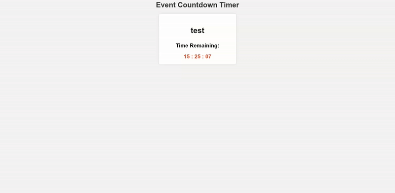

# a beginner level django project
- series of django projects for better undrestanding of the django framework


## Countdwon timer

## Features
- js for timer


## Installation 
```bash
# Clone the repository
git clone git@github.com:amirsoleimani7/count-down-timer.git
cd count-down-timer

# Create and activate a virtual environment
python -m venv venv
source venv/bin/activate  # On Windows: venv\Scripts\activate

# Install dependencies
pip install -r requirements.txt

# Run migrations
python manage.py migrate

# Start the development server
python manage.py runserver
```

# mian menu


